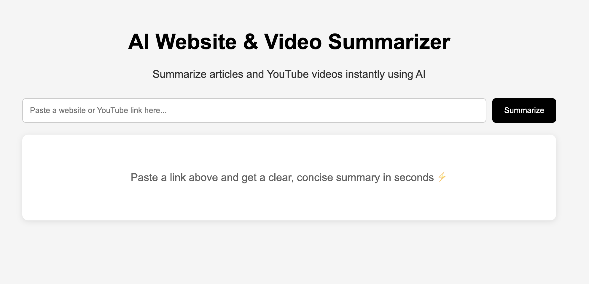

# 🚀 AI Website & YouTube Summarizer

An intelligent AI-powered web application that summarizes **articles and YouTube videos** instantly using modern AI and backend technologies.


## 📸 Preview



🌐 **Live Demo:** https://ai-summarizer-silk-nine.vercel.app/

---

## ✨ Features

- 🔗 Summarize any **website URL**
- 🎥 Summarize **YouTube videos**
- 🧠 AI-powered summaries using OpenAI
- ⚡ Fast and responsive UI
- 🔄 Smart fallback handling (handles failures gracefully)
- 🌍 Deployed and production-ready

---

## 🧠 How It Works

1. User enters a URL (article or YouTube link)
2. Backend processes the URL:
   - 🌐 Website → Scraped using BeautifulSoup / Selenium
   - 🎥 YouTube → Transcript or metadata extraction
3. Extracted content is sent to OpenAI API
4. AI generates a clean summary
5. Frontend displays formatted output

---

## ⚙️ Tech Stack

### 🖥️ Frontend
- HTML, CSS, JavaScript
- Marked.js (for rendering markdown)

### ⚙️ Backend
- FastAPI (Python)
- OpenAI API (AI summarization)

### 🔍 Data Extraction
- BeautifulSoup (static scraping)
- Selenium (dynamic content handling)
- pytube (YouTube metadata)

### ☁️ Deployment
- Frontend: Vercel
- Backend: Render

---

## 🧩 Key Engineering Highlights

- ✅ **Fallback Handling**
  - YouTube transcript failure → metadata summary
  - Scraping failure → graceful error handling

- ✅ **Environment-based Logic**
  - Local → Selenium enabled
  - Production → lightweight scraping

- ✅ **Robust Error Handling**
  - Prevents crashes on null/empty data
  - Handles invalid URLs and edge cases

- ✅ **API Safety**
  - Ensures valid content before sending to AI

---

## 🚨 Challenges Faced

- YouTube transcript blocking (IP-based restrictions)
- Handling JS-heavy websites vs static HTML
- Selenium not working in production (no Chrome in cloud)
- Dependency issues during deployment
- Managing multiple environments (local vs production)

---

## 💡 Learnings

- Real-world apps must handle **unreliable external systems**
- Environment differences can break working code
- Proper validation is critical before API calls
- Deployment is as important as development

---

## 📦 Installation (Local Setup)

```bash
git clone https://github.com/your-username/ai-summarizer.git
cd ai-summarizer

# install dependencies
pip install -r requirements.txt

# create .env file
OPENAI_API_KEY=your_api_key_here
ENV=local

# run backend
uvicorn main:app --reload

## 📸 Demo

You can try the application using:

- 🌐 Blog articles (Medium, Dev.to, etc.)
- 📰 News websites
- 🎥 YouTube videos (with or without transcripts)

👉 Simply paste a link and get an AI-generated summary instantly.

---

## 🚀 Future Improvements

- 🔥 Integrate Playwright for better handling of JS-heavy websites  
- 🎨 Enhance UI/UX with modern design and animations  
- 📊 Add summary history & saved results feature  
- 🌍 Support multi-language input and translation  
- ⚡ Improve performance with caching mechanisms  
- 🔐 Add authentication for personalized experience


## ⭐ Show Your Support

If you found this project helpful or interesting, please consider giving it a ⭐ on GitHub!

It helps others discover the project and motivates me to build more such applications 🚀

---

## 🙌 Feedback & Contributions

Feel free to open issues or submit pull requests if you have suggestions or improvements.

Your feedback is always welcome!